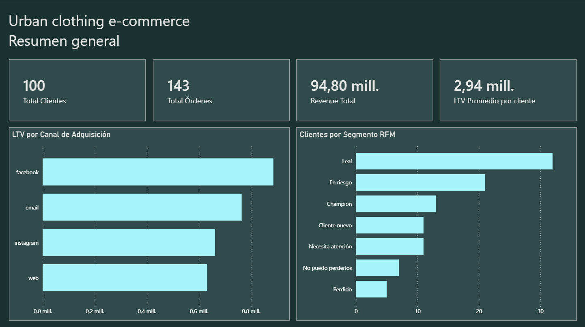
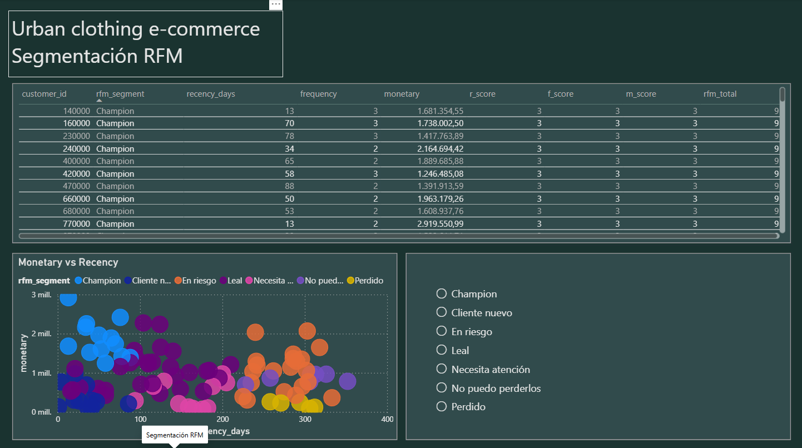
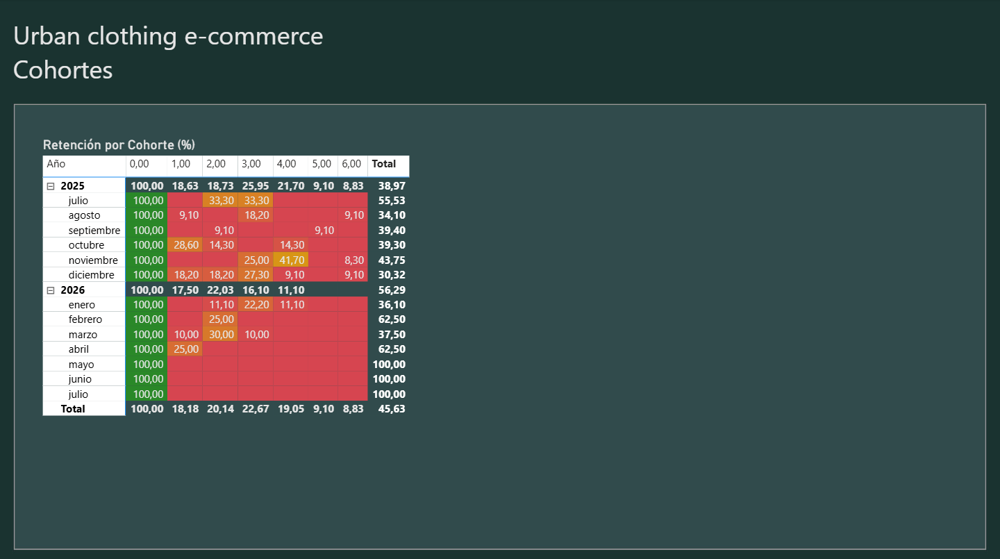

# davdat-analytics-pipeline

Pipeline de analytics end-to-end construido sobre datos de Shopify.

## Stack técnico

| Capa | Tecnología |
|------|-----------|
| Extracción | Python + Shopify OAuth API |
| Almacenamiento | DuckDB (local) + Supabase PostgreSQL (cloud) |
| Transformación | dbt Core |
| Visualización | Power BI |

## Dashboard

### Resumen General

### Segmentación RFM

### Cohortes de Retención

## Modelos dbt

**Staging:** stg_shopify__orders, stg_shopify__customers, stg_shopify__products

**Intermediate:** int_order_items, int_customer_order_sequence

**Marts:** dim_customers, fct_orders, fct_order_items, mrt_rfm, mrt_cohorts, mrt_ltv_by_channel

## Análisis incluidos

- Segmentación RFM con 7 segmentos
- Cohortes de retención mes a mes
- LTV por canal de adquisición

## Nota sobre los datos

Los datos reales son confidenciales. data/sample/ contiene datos sintéticos generados con faker (es_CO).

---
Construido por Juan David González | davdat
